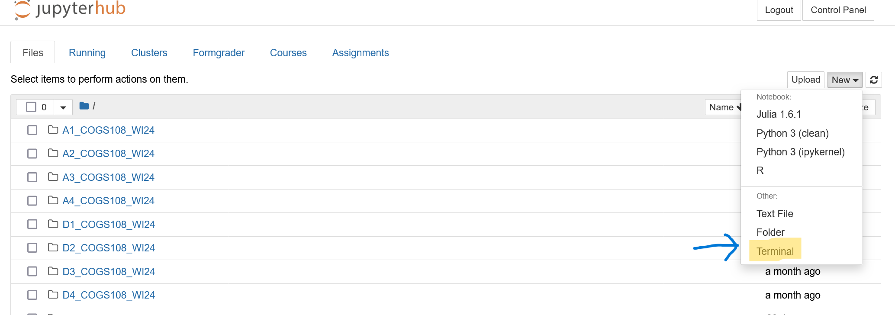
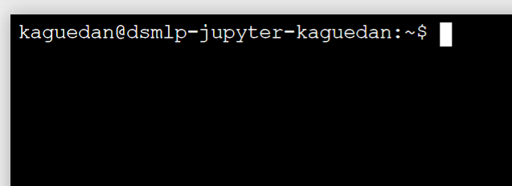
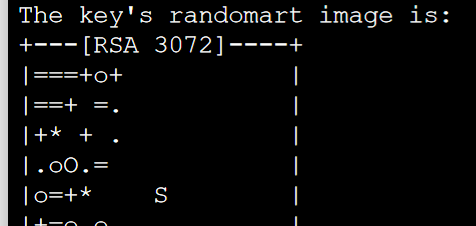
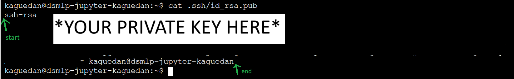
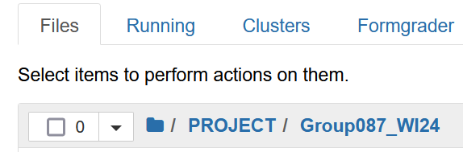
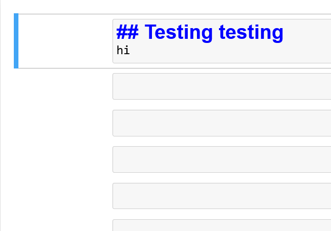

Hi! Glad you could check this page out. I'll very quickly go over how to have access to our COGS 108 Project notebooks within Datahub so that we can make edits and uplaod our changes more easily.

---

Before we start please have these pages open and logged in to your accounts:
- Github Settings
- Datahub Files

 

A tip while using the terminal: It can typically **autocomplete** words for you if you press \<TAB\> (as long as you have enough leading letters). Also everything is case sensitive!

---

# 1️⃣ Creating your private key

### Github Settings

- Go to **SSH and GPG keys** in the sidebar. 
- Click on **New SSH key**. 
- Name the "Title" anything you want that will remind you that this key is for Datahub/UCSD.

 

### Datahub

- Click **New** > **Terminal**.

    

 

You will see your own terminal prompt with your user info.

    

 

- Type `ssh-keygen` and press Enter.
- Press Enter 3 times until you see a "randomart" image.

    

 

- Run `cat .ssh/id_rsa.pub`. This prints out the contents of `id_rsa.pub` to the terminal. And it **should look like a bunch of random letters and numbers etc**. You will want to copy ALL of this using your mouse/trackpad (keybinds don't work consistently in the terminal). It should start from "ssh-rsa" and including the last "= kaguedan@dsmlp-jupyter-kaguedan" or whatever your particular user is called.

**DO NOT INCLUDE** the bottom-most line with the dollar sign. This is the *terminal prompt* and shows up when the terminal is ready for another command; it's not part of the ssh key itself.

    

 

### Github Settings

- **Paste the key** into the **Key** box.
- Click **Add SSH key**.
- You may have to login to Github etc.

 
 

---

# 2️⃣ Finalizing link and testing out edit/upload

Here you'll make changes to a test file in our Group Repository to make sure everything is working smoothly. I'll also let you know essential commands.

 

## Clone our Project repository

### Datahub Terminal

- Run `mkdir PROJECT`. Makes folder for our project where we can download the Jupyter notebooks from Github.
- Run `cd PROJECT`. Moves the terminal to our newly made folder.
- Run `git clone git@github.com:COGS108/Group087_WI24.git`. Type `yes` and press Enter. This will make a local copy of our group project files in your Datahub.
- Run `cd Group087_WI24`. Moves the terminal to the folder with all the work in it.
- Run `git config user.email "<your email>"`. (Replace the angle brackets too!)
- Run `git config user.name "<some name to identify you>"`. 

**NOTE:** The last two commands help Github identify you and track who made what changes. It will let us make commits and upload them. Without the last two steps, Github won't let us do any of that.

 

## Make some edits and push your changes in a test notebook

Now in another tab, go back to the normal Datahub Files homepage. 

### Datahub Files

Now you should see a folder named `PROJECT`! Keep clicking through the folders `Group087_WI24` until you see all the project files in the folder. Open the `github-datahub-test.ipynb` notebook.

    

 

- In a markdown cell, add some text or add your name. Hit save.

    

 

## Here's how to upload the changes you make:

### Datahub Terminal

- Run  `git add github-datahub-test.ipynb`. This will tell the terminal that you want to upload the changes specifically in the `github-datahub-test` notebook.
- Run `git commit -m "<enter your own note here>"` Records the changes you made and the message/note you wrote describing your change.
- Run `git push`. Uploads your changes to the actual Github repo for everyone to see (as long as they have the most updated version of the repository).

 

## See your edits!

### Github Group087_WI24 Repository

Now, in our repository page, you should see that `github-datahub-test.ipynb` was recently updated by you and shows your commit message. You can preview the file on Github to verify that the changes you made are there.

 
 

---

# 3️⃣ General Workflow for the Project

Every time you want make changes to the group notebook, you'll need a **terminal** and the **FinalProject_Group087_WI24.ipynb** notebook open on **Datahub**.

### In the terminal BEFORE making any edits:
- Run `cd PROJECT/Group087_WI24/` to move to your local copy of group repository in Datahub.
- **SUPER IMPORTANT!** Run `git pull` to **fetch the latest changes** made by anyone else in the group.

 

### Make your changes to the notebook on Datahub like normal and hit save when done.

 

### Use the terminal to push your changes.
- Run `git add FinalProject_Group087_WI24.ipynb`
- Run `git commit -m "<your message here>"`
- Run `git push`

After confirming everything is correctly uploaded, feel free to exit out of everything.

 
 

---

Hopefully these steps have been helpful. Please let me know if anything comes up!